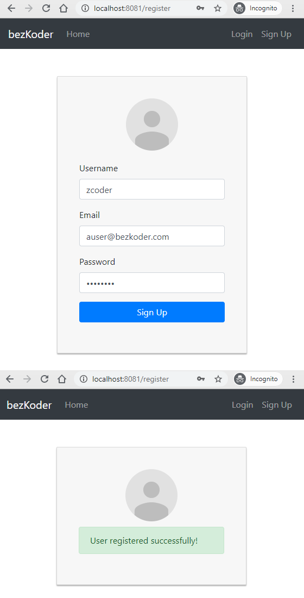
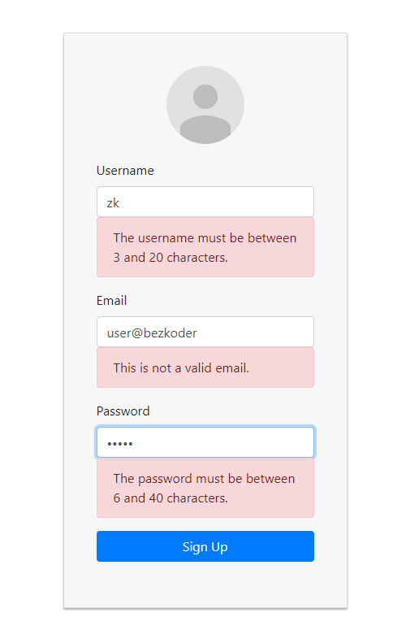
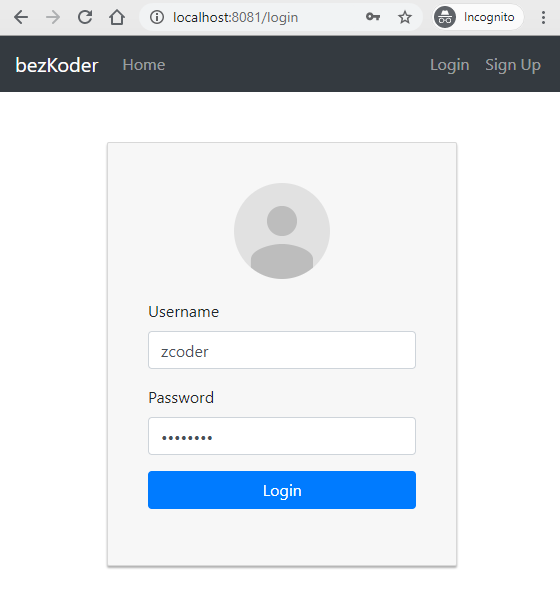
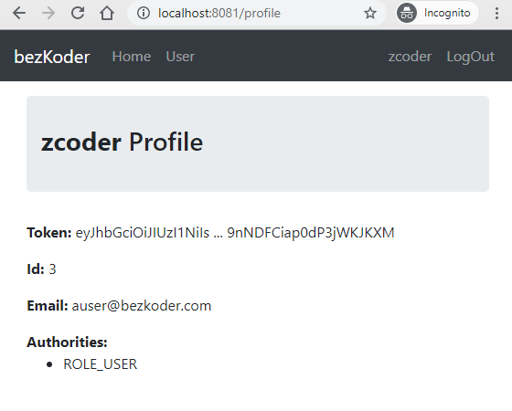

# React Typescript Login example with Axios and Web API

Build React Typescript Login and Registration example with React Router, Axios and Bootstrap (without Redux):
- JWT Authentication Flow for User Signup & User Login
- Project Structure for React Typescript Authentication (without Redux) with React Router & Axios
- Creating React Components with Form Validation using Formik and Yup
- React Typescript Components for accessing protected Resources (Authorization)
- Dynamic Navigation Bar in React Typescript App

For instruction, please visit:
> [React Typescript Login and Registration example](https://www.bezkoder.com/react-typescript-login-example/)

> [React Typescript Login and Registration example (using Hooks)](https://www.bezkoder.com/react-typescript-authentication-example/)

Signup Page:



Form Validation:



Login Page:



Profile Page:



This React Client works well with following back-end Server:
> [Spring Boot: JWT Authentication & Authorization with MySQL](https://www.bezkoder.com/spring-boot-jwt-authentication/)

> [Spring Boot: JWT Authentication & Authorization with PostgreSQL](https://www.bezkoder.com/spring-boot-security-postgresql-jwt-authentication/)

> [Spring Boot: JWT Authentication & Authorization with MongoDB](https://www.bezkoder.com/spring-boot-jwt-auth-mongodb/)

> [Node Express: JWT Authentication & Authorization with MySQL](https://www.bezkoder.com/node-js-jwt-authentication-mysql/)

> [Node Express: JWT Authentication & Authorization with PostgreSQL](https://www.bezkoder.com/node-js-jwt-authentication-postgresql/)

> [Node Express: WT Authentication & Authorization with MongoDB](https://www.bezkoder.com/node-js-mongodb-auth-jwt/)

Related Posts:
> [React Typescript CRUD example with Axios and Web API](https://www.bezkoder.com/react-typescript-axios/)

> [React Hooks Typescript CRUD example with Axios and Web API](https://www.bezkoder.com/react-typescript-api-call/)

> [React (Javascript) CRUD example to consume Web API](https://www.bezkoder.com/react-crud-web-api/)

> [React Hook Form Typescript example with Validation](https://www.bezkoder.com/react-hook-form-typescript/)

Fullstack with Node Express:
> [React + Node Express + MySQL](https://www.bezkoder.com/react-node-express-mysql/)

> [React + Node Express + PostgreSQL](https://www.bezkoder.com/react-node-express-postgresql/)

> [React + Node Express + MongoDB](https://www.bezkoder.com/react-node-express-mongodb-mern-stack/)

Fullstack with Spring Boot:
> [React + Spring Boot + MySQL](https://www.bezkoder.com/react-spring-boot-crud/)

> [React + Spring Boot + PostgreSQL](https://www.bezkoder.com/spring-boot-react-postgresql/)

> [React + Spring Boot + MongoDB](https://www.bezkoder.com/react-spring-boot-mongodb/)

Fullstack with Django:

> [React + Django Rest Framework](https://www.bezkoder.com/django-react-axios-rest-framework/)

Serverless:
> [React Typescript Firebase example: Build CRUD App](https://www.bezkoder.com/firebase-typescript-react/)

> [React Typescript Firestore example: Build CRUD App](https://www.bezkoder.com/react-typescript-firestore/)

Integration (run back-end & front-end on same server/port)
> [How to integrate React with Spring Boot](https://www.bezkoder.com/integrate-reactjs-spring-boot/)

> [Integrate React with Node Express on same Server/Port](https://www.bezkoder.com/integrate-react-express-same-server-port/)


This project was bootstrapped with [Create React App](https://github.com/facebook/create-react-app).

### Set port
.env
```
PORT=8081
```

## Project setup

In the project directory, you can run:

```
npm install
# or
yarn install
```

or

### Compiles and hot-reloads for development

```
npm start
# or
yarn start
```

Open [http://localhost:8081](http://localhost:8081) to view it in the browser.

The page will reload if you make edits.
